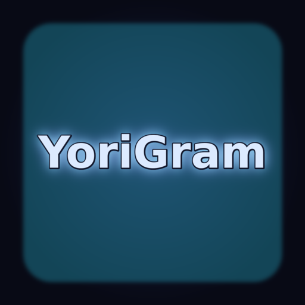

# YoriGram Desktop

YoriGram Desktop is a **personal-use, private rebrand experience** based on **AyuGram Desktop**, starting from the stable `v7.0.9` release.

The goal is to keep AyuGram Desktop's existing Telegram desktop functionality mostly the same, rebrand the interface and product identity to **YoriGram**, and later add selected extra features from other compatible open-source clients or original YoriGram code.

## Status

- Base selected: **AyuGram Desktop**
- Base version: **v7.0.9 stable**
- First target: **Windows desktop `.exe`**
- Intended audience: **small, limited, private/personal users**
- Commercial intent: **none**

The upstream AyuGram Desktop source has been imported as the starting base. A first safe YoriGram rebrand pass has started for product-facing names, Windows metadata, installer identity, and main UI labels.

## Personal-use / private-client notice

YoriGram is intended for personal experience, private testing, and limited-user use only. It is not intended to be a commercial product, a public Telegram replacement, or an official Telegram application.

Private/non-commercial intent does **not** remove open-source license duties. When this project distributes binaries to private users, it must still keep required notices and provide corresponding source where required by the upstream licenses.

## Unofficial disclaimer

YoriGram is not affiliated with, endorsed by, sponsored by, or approved by Telegram, AyuGram, Radolyn Labs, or any other upstream project/maintainer.

Telegram is a trademark of its respective owners. YoriGram must always identify itself as an unofficial client.

## Upstream base

YoriGram is based on:

- [AyuGram Desktop](https://github.com/AyuGram/AyuGramDesktop)
- [Telegram Desktop](https://github.com/telegramdesktop/tdesktop), through AyuGram Desktop

The imported AyuGram base is documented in [`docs/UPSTREAMS.md`](docs/UPSTREAMS.md). A copy of the upstream AyuGram README at the imported base is kept at [`docs/upstream/AYUGRAM_README.md`](docs/upstream/AYUGRAM_README.md).

## Rebrand policy

YoriGram will rebrand product-facing AyuGram identity such as:

- app display name;
- window title;
- executable/installer names where practical;
- icons and splash/visual identity;
- About/settings UI labels;
- private build notices.

YoriGram will **not** erase required upstream legal attribution. Legal files, copyright notices, license text, and credits must remain accurate.

See [`docs/REBRAND_PLAN.md`](docs/REBRAND_PLAN.md) and [`docs/YORIGRAM_NOTICE.md`](docs/YORIGRAM_NOTICE.md).

## Roadmap

1. Import AyuGram Desktop `v7.0.9` stable base.
2. Confirm build requirements for Windows.
3. Rebrand safe user-facing AyuGram identity to YoriGram.
4. Keep AyuGram/Telegram Desktop credits and license notices.
5. Add separate YoriGram app identity/storage where safe.
6. Review another repo for one useful feature AyuGram does not already have.
7. Build private Windows `.exe` preview for limited users.

## Documentation

- [`docs/PROJECT_PLAN.md`](docs/PROJECT_PLAN.md)
- [`docs/UPSTREAMS.md`](docs/UPSTREAMS.md)
- [`docs/REBRAND_PLAN.md`](docs/REBRAND_PLAN.md)
- [`docs/FEATURE_BACKLOG.md`](docs/FEATURE_BACKLOG.md)
- [`docs/YORIGRAM_NOTICE.md`](docs/YORIGRAM_NOTICE.md)
- [`docs/IMPORT_NOTES.md`](docs/IMPORT_NOTES.md)
- [`docs/REBRAND_INVENTORY.md`](docs/REBRAND_INVENTORY.md)
- [`docs/ICON_WORKFLOW.md`](docs/ICON_WORKFLOW.md)
- [`docs/WINDOWS_EXE.md`](docs/WINDOWS_EXE.md)
- [`docs/AUDIT_2026-09-07.md`](docs/AUDIT_2026-09-07.md)
